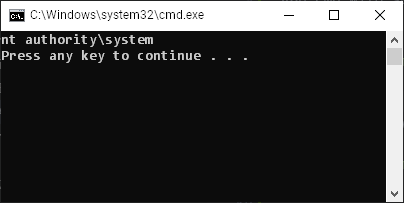

# RunTI

`/EXEFilename` - the name of the executable file that will be launched
`/CommandLine` - the command-line arguments to be passed to the executable
`/StartDirectory` - the directory path from which the executable will be run

## Open Command Prompt in a Specific Directory

This command opens Command Prompt (cmd.exe) in a specific directory:
```shell
RunTI.exe /EXEFilename cmd.exe /StartDirectory C:\
```

Or with spaces in the path:
```shell
RunTI.exe /EXEFilename cmd.exe /StartDirectory "C:\Program Files\Internet Explorer"
```

Also you can run specific command as system
```shell
RunTI.exe /EXEFilename cmd.exe /CommandLine "/c whoami & pause"
```




## Run script files

This command executes a **batch** script file `C:\test.bat` as system
```shell
RunTI.exe /EXEFilename cmd.exe /CommandLine "/c C:\test.bat"
```

This command executes a **powershell** script file `C:\test.ps1` as system
```shell
RunTI.exe /EXEFilename cmd.exe /CommandLine "/c PowerShell -ExecutionPolicy Unrestricted -File C:\test.ps1"
```

## Open Services or Other Administrative Tools as System

This command opens services (`services.msc`) or other administrative tools, such as Registry Editor (`regedit.exe`) or Group Policy Editor (`gpedit.msc`)
```shell
RunTI.exe /EXEFilename services.msc
```


# Credits

https://github.com/ADeltaX/RunTI